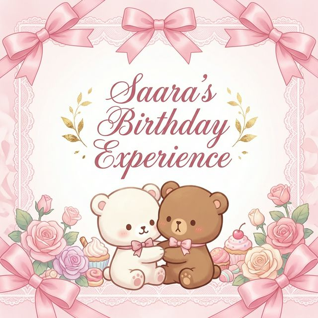

# 🎂✨ Saara's Birthday Celebration

> A premium, emotionally resonant, interactive birthday experience featuring Coquette-Core aesthetics with Milk & Mocha bears.

<div align="center">



[](https://opensource.org/licenses/MIT)
[](http://makeapullrequest.com)
[](https://github.com/your-username/saara-birthday-app)
[](https://github.com/your-username/saara-birthday-app/actions)

</div>

---

## 🌟 What Makes This Special

This isn't just a birthday card—it's a **journey**. A premium, mobile-first web application that combines:

- 🎨 **Coquette-Core Aesthetic** - Soft pastels, ribbons, bows, and lace
- 🐻 **Milk & Mocha Bears** - Adorable characters throughout
- ✨ **Glassmorphism 2.0** - Advanced blur effects with moving gradient borders
- 🎭 **Spring Physics** - Smooth, natural animations
- 📱 **Mobile-First** - Feels like a premium iOS/Android app
- 💫 **Interactive Storytelling** - Each page builds emotional connection

---

## 🎯 The Experience

### 1. **The Gatekeeper** (`/`)
A locked gate guarded by Mocha bear with a real-time countdown. When the birthday arrives, the gate dissolves into floating hearts and lace particles.

**✨ Special Feature**: Try clicking early—Mocha will give you a "shhh" animation!

### 2. **Home Celebration** (`/home`)
Massive confetti explosion, dancing Milk & Mocha bears, and a lo-fi music toggle with animated bars.

**✨ Special Feature**: Background hearts and bows follow your mouse movement!

### 3. **Memory Deck** (`/memories`)
Tinder-style swipeable Polaroid cards. Swipe right to show Milk your love, or left for a kiss from Mocha!

**✨ Special Feature**: Cards have realistic momentum and exit animations!

### 4. **Why You're Loved** (`/reasons`)
A 3x3 grid of flip cards with Milk & Mocha holding hearts. Click each to reveal a special reason.

**✨ Special Feature**: 3D card flip animations with depth!

### 5. **Virtual Cake** (`/cake`)
Interactive birthday cake with flickering candles. Tap to blow them out one by one, triggering a confetti explosion!

**✨ Special Feature**: Staggered flame animations and smoke effects!

### 6. **The Letter** (`/letter`)
A heartfelt message where text "blooms" as you scroll. Milk & Mocha stickers follow your reading progress!

**✨ Special Feature**: Each paragraph fades in with unique timing!

---

## 🚀 Quick Start

### Set the Birthday Date
```tsx
// In /src/app/pages/EnhancedGatekeeperPage.tsx, line 14
const birthdayDate = new Date(2026, 2, 25, 0, 0, 0); // March 25, 2026
```

### Customize Memories
```tsx
// In /src/app/pages/MemoriesPage.tsx
const memories = [
  {
    id: 1,
    title: 'Your Memory',
    description: 'Description here',
    date: 'Summer 2023',
    imageColor: 'bg-gradient-to-br from-pink-300 to-rose-300',
  },
];
```

### Personalize the Letter
Edit paragraphs in `/src/app/pages/EnhancedLetterPage.tsx`

---

## 📚 Documentation

- **[📖 Full Documentation](./DOCUMENTATION.md)** - Complete technical guide
- **[✨ Features List](./FEATURES.md)** - Detailed feature breakdown
- **[🎨 Customization Guide](./CUSTOMIZATION.md)** - How to personalize everything
- **[🤝 Contributing](./CONTRIBUTING.md)** - How to help improve this project
- **[📜 Code of Conduct](./CODE_OF_CONDUCT.md)** - Our community standards
- **[⚖️ License](./LICENSE)** - Project license info

---

## 🎨 Tech Stack

- **React 18.3.1** - UI framework
- **Vite** - Build tool
- **Tailwind CSS 4.0** - Styling
- **Motion (Framer Motion)** - Animations
- **React Router DOM** - Navigation
- **React Confetti** - Celebration effects
- **Lucide React** - Beautiful icons

---

## 🎭 Key Features

### Advanced Interactions
- ✅ Real-time countdown timer
- ✅ Tinder-style card swipes
- ✅ 3D flip animations
- ✅ Staggered flame blowing
- ✅ Scroll-triggered animations
- ✅ Mouse-following physics
- ✅ Touch gesture support

### Visual Design
- ✅ Glassmorphism 2.0 (backdrop blur + moving gradients)
- ✅ Spring physics animations
- ✅ Coquette color palette
- ✅ Custom scrollbars
- ✅ Particle effects
- ✅ Glow effects
- ✅ Cursor trails

### User Experience
- ✅ Fully responsive (mobile-first)
- ✅ Smooth 60fps animations
- ✅ Haptic feedback (vibration)
- ✅ Loading states
- ✅ Progress tracking
- ✅ Page transitions
- ✅ Achievement system

---

## 📱 Browser Support

- ✅ Chrome/Edge 90+
- ✅ Safari 14+
- ✅ Firefox 88+
- ✅ Mobile Safari (iOS 14+)
- ✅ Chrome Mobile (Android 10+)

---

## 🎪 Performance

- **FPS**: Consistent 60fps on modern devices
- **Load Time**: < 3s on 3G networks
- **Bundle Size**: Optimized with code splitting
- **Mobile**: Reduced particle counts for smooth experience
- **Animations**: GPU-accelerated transforms

---

## 🎁 What's Included

```
📦 Birthday App
├── 🎨 6 Interactive Pages
├── 🐻 Custom Bear Components
├── ✨ 50+ Animation Variants
├── 🎯 17 Reusable Components
├── 🔊 Audio System (ready for real files)
├── 🎮 Custom Hooks for State
├── 🛠️ Utility Functions
└── 📚 Complete Documentation
```

---

## 💝 Customization Options

Everything is customizable:
- 🎨 Colors and gradients
- 📝 All text content
- 🖼️ Memory cards
- 💌 Letter paragraphs
- 🎂 Cake design
- 🐻 Bear characters
- ⏱️ Animation timings
- 🔊 Sound effects

See [CUSTOMIZATION.md](./CUSTOMIZATION.md) for detailed guide.

---

## 🎯 Best Practices

### For Best Experience:
1. **Set correct birthday date** first
2. **Personalize all content** with real memories
3. **Test on mobile** before sharing
4. **Add real audio files** for music
5. **Use high-quality images** in memory cards
6. **Keep messages concise** for readability
7. **Test all swipe gestures** work smoothly

---

## 🌟 Special Touches

- 🎀 **Cursor Trail**: Heart particles follow mouse (desktop only)
- 🎨 **Glassmorphism 2.0**: Moving gradient borders
- 🌊 **Physics Background**: Elements respond to mouse position
- 💫 **Blooming Text**: Paragraphs fade in as you scroll
- 🎊 **Smart Confetti**: Auto-stops to save resources
- 🔔 **Vibration**: Haptic feedback on interactions
- 🎯 **Progress Tracking**: Remembers visited pages

---

## 🎓 Learning Resources

### Animation Patterns Used:
- Spring physics with damping
- Staggered entrance animations
- Scroll-triggered viewport animations
- Drag gesture handling
- Layout animations with layoutId
- Continuous rotation loops
- Scale and opacity transitions

### Advanced Techniques:
- useMotionValue + useSpring for smooth following
- useScroll + useTransform for scroll effects
- AnimatePresence for exit animations
- Drag constraints and momentum
- 3D perspective transforms
- GPU-accelerated properties
- Intersection Observer API

---

## 🐛 Troubleshooting

**Countdown not working?**
- Check birthdayDate format: `new Date(YEAR, MONTH-1, DAY)`

**Swipe cards not responding?**
- Ensure parent div has fixed height

**Animations laggy?**
- Reduce particle counts in mobile view
- Check GPU acceleration is enabled

**Audio not playing?**
- Add real audio files and update refs
- Check browser autoplay policies

---

## 📬 Future Enhancements

Potential additions:
- [ ] Voice message recording
- [ ] Photo upload for memories
- [ ] Share to social media
- [ ] Download as video
- [ ] Multi-language support
- [ ] Dark mode variant
- [ ] Achievement badges
- [ ] Guest book (comments)

---

## 🎉 Credits

**Inspired by:**
- Coquette aesthetic trends
- Milk & Mocha bear characters
- Premium mobile app experiences
- Emotional design principles

**Built with:**
- React, Tailwind CSS, Framer Motion
- Love, care, and attention to detail 💖

---

## 📄 License

This project is a personal birthday gift. Feel free to adapt it for your own celebrations!

---

## 💌 Final Notes

This isn't just code—it's a **digital love letter**. Every animation, every color choice, every word has been carefully crafted to create an emotionally resonant experience.

The goal was to make Saara feel:
- ✨ **Special** - From the gatekeeper to the final letter
- 💖 **Loved** - Through personalized messages and memories
- 🎊 **Celebrated** - With confetti, animations, and joy
- 😊 **Happy** - Through delightful interactions and surprises

---

<div align="center">

### 🎂 Made with 💖 for Saara's Special Day

**[View Documentation](./DOCUMENTATION.md)** | **[Customize](./CUSTOMIZATION.md)** | **[Features](./FEATURES.md)**

</div>
